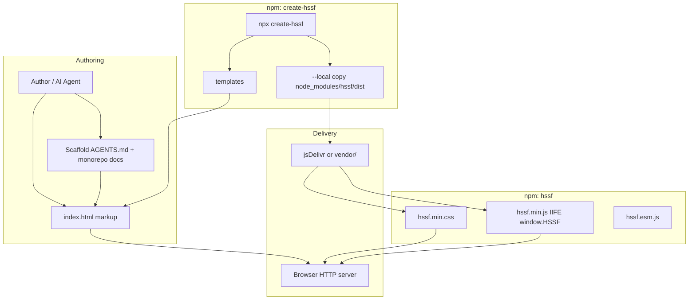
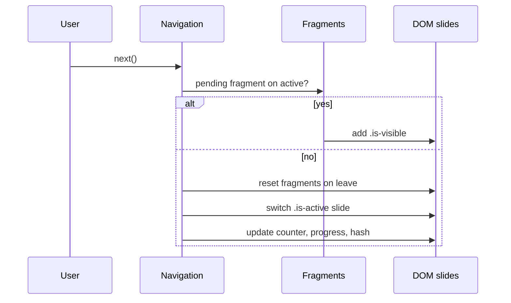

# HSSF — HTML Slide Simple Framework

| Trường | Giá trị |
|--------|---------|
| **Document title** | HSSF Design Document (Rikkei Education) |
| **Author** | TBD (Engineering / Design) |
| **Date** | 2026-07-16 |
| **Status** | Draft (rev. 3 — post re-review) |
| **Scope** | Component library + runtime + scaffold CLI + sample deck + agent docs |
| **Audience** | Senior engineers, content authors, AI coding agents |
| **Reference deck** | `(Slide) Session 4.pptx` — Docker Compose / Dockerfile (28 slides, 16:9) |
| **License** | **MIT** (MUST for both packages) |
| **Normative language** | **MUST** / **SHOULD** / **MAY** as in RFC 2119 |

---

## Overview

HSSF (HTML Slide Simple Framework) là **thư viện component dành riêng cho slide đào tạo Rikkei Education / Rikkei Academy**. Triết lý **shadcn-like authoring UX**: người dùng (hoặc AI agent) **copy-paste HTML markup** theo convention — **không** phải mô hình shadcn “copy source component vào app và tự build”. Runtime được **publish versioned** dưới dạng CSS/JS (`hssf` trên npm/jsDelivr). Không phải framework SPA presentation đầy đủ (không Reveal.js clone, không admin drag-drop).

Giải pháp gồm ba phần: (1) **runtime** `hssf` — design tokens + shell chrome + navigation/fragments; (2) **catalog component** — markup + class names theo nhóm; (3) **CLI** `create-hssf` — `npx create-hssf my-deck` sinh template portable kèm **AGENTS.md self-contained** để agent viết deck mới không cần monorepo docs.

---

## Background & Motivation

### Hiện trạng

- Slide đào tạo Rikkei chủ yếu là **PowerPoint** (Session 4: *Docker Compose và Dockerfile cơ bản*, **28 slides**, aspect 16:9 `12192000×6858000` EMU).
- Visual identity: **trắng + đỏ**, font **Montserrat** (ExtraBold/SemiBold cho UI), **Courier New** cho code.
- Footer reference (chuỗi exact từ PPTX):  
  `© 2022 By Rikkei Academy - Rikkei Education - All rights reserved.`  
  (năm trong reference là **2022**; scaffold inject năm tạo deck — xem KD-16).
- Pattern giảng dạy: title → agenda → section divider → cards bối cảnh → vấn đề (code + callout) → step-by-step → code → so sánh → tổng kết → end branding.

**Palette note:** Tokens HSSF là **curated subset** của màu quan sát trong Session 4 (primary/soft/text/code + semantic), **không** exhaustive map mọi màu PPTX (`#064E3B`, `#6AA84F`, `#C00000`, `#44546A`, Material Icons, …). Chi tiết tần suất → `reference/session-4-notes.md` (commit trong PR-02).

### Pain points

| Vấn đề | Hệ quả |
|--------|--------|
| PPTX khó version control / review diff | PR review nội dung bài giảng kém hiệu quả |
| Không portable cho web/offline browser | Phụ thuộc PowerPoint / Google Slides |
| AI agent khó sinh PPTX đúng brand | Agent sinh HTML dễ hơn nếu có cookbook class rõ ràng |
| Thiếu “khung” thống nhất | Mỗi deck HTML tự chế navigation/layout khác nhau |

### Motivation

1. Giảng viên / dev copy-paste HTML tạo deck.
2. AI agent đọc docs (đặc biệt scaffold `AGENTS.md`) và sinh deck đầy đủ.
3. Publish runtime một lần (npm + jsDelivr); deck là HTML tĩnh phục vụ qua HTTP(S).

---

## Goals & Non-Goals

### Goals

1. Runtime CSS/JS nhỏ, **MUST** publish **npm** + consume **jsDelivr** (hoặc self-host/`--local`) cho **v0.1 exit**.
2. Scaffold `npx create-hssf <name>` tạo deck portable trong vài giây.
3. Catalog component v1 **nhỏ nhưng đủ** cho lecture kiểu Session 4.
4. Visual identity Rikkei (white/red, Montserrat, tokens từ PPTX).
5. Docs **agent-oriented**; scaffold **self-contained** (không phụ thuộc monorepo `docs/`).
6. Giao hàng **từng phần** (PR Plan incremental).
7. **Tests + CI** cho navigation/fragments; size budget có enforcement script.

### Non-Goals (v0.1)

- Không admin UI, drag-drop editor, CMS.
- Không multi-tenant theming / white-label ngoài Rikkei Education.
- Không Web Components / React/Vue runtime bắt buộc.
- Không animation engine phức tạp (chỉ fade fragment tối thiểu).
- Không live collaboration, remote control server.
- **Speaker notes panel** — non-goal v0.1 (Open Q → v0.2).
- **Overview / slide picker / grid view** — non-goal v0.1 (Open Q → v0.2).
- **Icon font / Material Icons** — non-goal; dùng text trong `hssf-icon-circle` hoặc `` SVG tùy author.
- Không pure CSS scroll-snap-only deck (thiếu fragment teaching control).
- Không thay PowerPoint export pipeline hoàn hảo (print/PDF **SHOULD** best-effort).
- Không Prism / custom `hssf-tok-*` syntax colors — dùng **highlight.js + atom-one-dark** (bundled).

---

## Key Decisions

| # | Quyết định | Rationale |
|---|------------|-----------|
| KD-1 | **Dual packages**: `hssf` + `create-hssf` trong **pnpm** monorepo | Runtime version độc lập CLI; jsDelivr ổn định theo `hssf` |
| KD-2 | **Class-based API** (`hssf-*`), **không** Web Components | Authoring UX copy markup; zero framework lock-in |
| KD-3 | Prefix **`hssf-`**, data attrs **`data-hssf-*`** | Tránh collision |
| KD-4 | Aspect **16:9**; stage fixed `var(--hssf-slide-w/h)` = **1920×1080**; scale **chỉ** `transform` (cấm `zoom`); stage **`position: absolute`** centered in wrap so layout box không chiếm 1920×1080 trong flow | Khớp PPTX; **no document scrollbars** on small viewports |
| KD-5 | Fragment: author **chỉ** `data-hssf-fragment` (+ optional variant value); runtime set index + toggle **`.is-visible`**; **reset fragments khi rời slide** | Contract đơn giản; teaching default |
| KD-6 | CDN default; `--local` copy từ **`create-hssf` dependency `hssf`** → `vendor/` | Offline sau khi npm đã resolve packages |
| KD-7 | Sample: **Git Fundamentals cho Fresher** | Catalog coverage; không copy Session 4 content |
| KD-8 | Docs monorepo `docs/` + **scaffold `AGENTS.md` self-contained** (condensed cookbook) | Agent-first offline |
| KD-9 | Semver; dual dist: **IIFE** `hssf.min.js` → `window.HSSF` + **ESM** `hssf.esm.js`; CSS min + unmin | CDN classic script + bundler |
| KD-10 | JS surface: `HSSF.init`, deck methods, events, `HSSF.version` | Đủ embed/test |
| KD-11 | **Tooling lock**: **pnpm** workspaces + **esbuild** (JS) + CSS **concat** (esbuild or simple script); no TS required v0.1 (JSDoc OK) | Tránh thrash PR-01 |
| KD-12 | **License: MIT** | Copy-paste HTML culture; unblock publish |
| KD-13 | **npm names**: prefer `hssf` + `create-hssf` (verified **available** 2026-07-16); fallback runtime **`hssf-slides`** if taken at publish | Publish safety |
| KD-14 | **No peerDependency** wording confusion: `create-hssf` has **`dependencies: { "hssf": "<same-version>" }`** for `--local` copy only; generated deck **does not** `npm install` | Clear offline path |
| KD-15 | **Highlighting**: **highlight.js** (`lib/common`) + official **Atom One Dark** CSS (`styles/atom-one-dark.css`) bundled into `hssf` dist; `init()` auto-highlights `pre code` | Real theme (not hand-rolled); training decks are code-heavy |
| KD-16 | **Footer year**: CLI injects **year of deck creation** (default `new Date().getFullYear()`); template `{{YEAR}}`; not dynamic JS at runtime | Matches authoring, not reference PPTX year 2022 |
| KD-17 | **Serve over HTTP(S)** MUST for reliable use; `file://` best-effort only | Fullscreen, some browser restrictions |
| KD-18 | **Nav/progress outside** scaled stage (viewport chrome) | Hit targets; không scale nút |
| KD-19 | Inactive slides: **absolute stack** + `visibility: hidden` + `aria-hidden="true"`; only `.is-active` visible | Stable stage size |
| KD-20 | **v0.1 exit MUST include npm publish** both packages | Goals require CDN |

---

## Proposed Design

### A. Package architecture

#### A.1 Monorepo layout (library repo)

```
hssf/                              # git root
├── package.json                   # private root; scripts: build, test, lint, size
├── pnpm-workspace.yaml
├── pnpm-lock.yaml
├── LICENSE                        # MIT
├── .github/workflows/ci.yml       # build + test + size on PR
├── packages/
│   ├── hssf/                      # publish name: hssf (fallback hssf-slides)
│   │   ├── package.json
│   │   ├── src/
│   │   │   ├── css/
│   │   │   │   ├── tokens.css
│   │   │   │   ├── base.css
│   │   │   │   ├── chrome.css
│   │   │   │   ├── components/
│   │   │   │   │   ├── layout.css
│   │   │   │   │   ├── content.css
│   │   │   │   │   ├── teaching.css
│   │   │   │   │   ├── visual.css
│   │   │   │   │   └── media.css
│   │   │   │   └── print.css
│   │   │   └── js/
│   │   │       ├── index.js       # public API, dual build entry
│   │   │       ├── navigation.js
│   │   │       ├── fragments.js
│   │   │       ├── progress.js
│   │   │       ├── scale.js
│   │   │       └── fullscreen.js
│   │   ├── dist/                  # build outputs (see A.2)
│   │   ├── test/                  # node + playwright unit/integration
│   │   └── README.md
│   └── create-hssf/
│       ├── package.json           # dependencies: { "hssf": "0.1.0" }
│       ├── bin/create-hssf.js
│       ├── src/
│       │   ├── index.js
│       │   ├── copy-vendor.js     # ESM: createRequire → resolve hssf package root
│       │   └── prompts.js
│       └── templates/
│           ├── default/           # minimal 3–5 slides
│           └── sample/            # optional full sample copy
├── examples/
│   ├── smoke/                     # 2–3 slides for early PRs
│   └── sample-deck/               # full 18-slide Git fresher
│       └── index.html             # links ../../packages/hssf/dist/* (workspace)
├── docs/                          # full monorepo docs
├── AGENTS.md                      # contributor agents
├── scripts/
│   ├── build.mjs                  # esbuild IIFE+ESM, CSS concat/minify
│   ├── size-check.mjs             # fail if over budget
│   └── release.mjs                # bump both packages same version
└── reference/
    └── session-4-notes.md         # brand extraction (PR-02)
```

**Tooling (locked — KD-11):**

| Tool | Use |
|------|-----|
| **pnpm** | workspaces, lockfile |
| **esbuild** | bundle JS → IIFE + ESM; optional CSS minify |
| CSS | ordered concat of `src/css/**` → `dist/hssf.css` / `.min.css` |
| Node | ≥ 18 |
| Test | **node:test** (or vitest) for pure nav/fragment logic; **Playwright** smoke on sample (CI) |

#### A.2 Package names, versioning, dual build

| Package | npm name | Fallback if taken | Role |
|---------|----------|-------------------|------|
| Runtime | **`hssf`** | **`hssf-slides`** | CSS + JS |
| CLI | **`create-hssf`** | (re-check at publish; low risk) | scaffold |

**npm availability check (2026-07-16):** `hssf`, `hssf-slides`, `create-hssf`, `rikkei-hssf` all **404 / free**. Re-verify at PR-14 before publish.

**Version coupling (MUST):**

- Both packages share the **same version string** (e.g. `0.1.0`) via `scripts/release.mjs`.
- Template placeholder `{{HSSF_VERSION}}` replaced at scaffold time with `create-hssf`'s own `package.json` version (which equals `hssf` dependency version).
- `create-hssf/package.json`:

```json
{
  "name": "create-hssf",
  "version": "0.1.0",
  "bin": { "create-hssf": "bin/create-hssf.js" },
  "dependencies": {
    "hssf": "0.1.0"
  },
  "engines": { "node": ">=18" }
}
```

- **No peerDependencies.** Dependency exists solely so CLI can resolve `hssf` package root and copy `node_modules/hssf/dist/*` for `--local` after `npx` installs create-hssf (and its deps). Resolution uses **`createRequire`** (see D.3) because packages are ESM.

**Runtime `package.json` (normative):**

```json
{
  "name": "hssf",
  "version": "0.1.0",
  "description": "HTML Slide Simple Framework for Rikkei Education",
  "license": "MIT",
  "type": "module",
  "main": "./dist/hssf.esm.js",
  "module": "./dist/hssf.esm.js",
  "browser": "./dist/hssf.min.js",
  "exports": {
    ".": {
      "import": "./dist/hssf.esm.js",
      "default": "./dist/hssf.esm.js"
    },
    "./browser": "./dist/hssf.min.js",
    "./hssf.css": "./dist/hssf.css",
    "./hssf.min.css": "./dist/hssf.min.css",
    "./hssf.min.js": "./dist/hssf.min.js",
    "./hssf.esm.js": "./dist/hssf.esm.js",
    "./package.json": "./package.json"
  },
  "files": ["dist", "README.md", "LICENSE"],
  "sideEffects": ["*.css"]
}
```

**Build outputs (MUST):**

| File | Format | Purpose |
|------|--------|---------|
| `dist/hssf.min.js` | **IIFE**, minified | CDN + scaffold; sets **`window.HSSF`** |
| `dist/hssf.js` | IIFE, unminified | debug CDN/local |
| `dist/hssf.esm.js` | **ESM** (`export { init, version }`) | bundlers; does **not** require global |
| `dist/hssf.css` / `hssf.min.css` | CSS | all tokens + components |

**CDN / scaffold script (classic — MUST default):**

```html
<link rel="stylesheet" href="https://cdn.jsdelivr.net/npm/hssf@0.1.0/dist/hssf.min.css" />
<script src="https://cdn.jsdelivr.net/npm/hssf@0.1.0/dist/hssf.min.js" defer></script>
<script>
  document.addEventListener('DOMContentLoaded', function () {
    window.HSSF.init(document.querySelector('[data-hssf-canvas]'));
  });
</script>
```

**ESM alternative (MAY):**

```html
<script type="module">
  import { init } from 'https://cdn.jsdelivr.net/npm/hssf@0.1.0/dist/hssf.esm.js';
  init(document.querySelector('[data-hssf-canvas]'));
</script>
```

ESM build **SHOULD** also assign `globalThis.HSSF` when `typeof window !== 'undefined'` for consistency (optional nicety); IIFE is the contract for classic tags.

#### A.3 jsDelivr URL patterns

```
https://cdn.jsdelivr.net/npm/hssf@0.1.0/dist/hssf.min.css
https://cdn.jsdelivr.net/npm/hssf@0.1.0/dist/hssf.min.js
```

Scaffold **MUST** pin **exact** version (`@0.1.0`), not `@0.1` floating, for reproducibility.

**SRI (SHOULD at release):** After publish, document `integrity` + `crossorigin="anonymous"` in `docs/quickstart.md` and release notes. Example shape (hashes filled at PR-14):

```html
<link rel="stylesheet" href="https://cdn.jsdelivr.net/npm/hssf@0.1.0/dist/hssf.min.css"
  integrity="sha384-…" crossorigin="anonymous" />
<script src="https://cdn.jsdelivr.net/npm/hssf@0.1.0/dist/hssf.min.js"
  integrity="sha384-…" crossorigin="anonymous" defer></script>
```

#### A.4 Generated deck layout

**CDN mode (default):**

```
my-deck/
├── index.html
├── assets/images/.gitkeep
├── styles/deck.css
├── AGENTS.md              # self-contained agent cookbook
└── README.md              # MUST: serve via HTTP (npx serve / Live Server)
```

**`--local` mode (additional):**

```
my-deck/
├── vendor/
│   ├── hssf.min.css       # copied from node_modules/hssf/dist/
│   ├── hssf.min.js        # IIFE
│   └── fonts/             # optional Montserrat woff2 subset (see offline checklist)
│       └── README.md      # how fonts were obtained / license
├── ...
```

**Offline checklist (`--local` + fully offline — MUST document in README/AGENTS):**

1. Use `--local` so CSS/JS không gọi jsDelivr.
2. Replace Google Fonts `<link>` bằng `@font-face` trỏ `vendor/fonts/*.woff2` **hoặc** accept system-ui fallback stack (Montserrat may missing).
3. Serve via local static server (`npx serve .`) — still “offline” relative to internet if server is local.
4. No external images/CDNs in deck content.

**`--local` byte source (normative — KD-6, KD-14):**

```
npx create-hssf → npm installs create-hssf@X + dependency hssf@X
create-hssf src/copy-vendor.js (ESM — see D.3):
  resolve hssf package root via createRequire(import.meta.url)
  copy <hssfRoot>/dist/hssf.min.css → vendor/
  copy <hssfRoot>/dist/hssf.min.js  → vendor/
```

Does **not** fetch CDN at generate time. Works offline if packages already in npm cache.

**Monorepo sample deck** links:

```html
<link rel="stylesheet" href="../../packages/hssf/dist/hssf.css" />
<script src="../../packages/hssf/dist/hssf.js" defer></script>
```

Published docs examples use CDN pin.

**v1:** single `index.html` ≤ ~40 slides. Multi-file include non-goal.

---

### B. Runtime & primitives (“khung”)

#### B.1 HTML skeleton (canonical)

```html
<!DOCTYPE html>
<html lang="vi">
<head>
  <meta charset="utf-8" />
  <meta name="viewport" content="width=device-width, initial-scale=1" />
  <title>Session 01 — Git Fundamentals cho Fresher | Rikkei Education</title>
  <!-- CDN fonts (default online). For --local offline, see vendor/fonts + AGENTS.md -->
  <link rel="preconnect" href="https://fonts.googleapis.com" />
  <link rel="preconnect" href="https://fonts.gstatic.com" crossorigin />
  <link href="https://fonts.googleapis.com/css2?family=Montserrat:wght@400;500;600;700;800&display=swap" rel="stylesheet" />
  <link rel="stylesheet" href="https://cdn.jsdelivr.net/npm/hssf@{{HSSF_VERSION}}/dist/hssf.min.css" />
  <link rel="stylesheet" href="./styles/deck.css" />
</head>
<body class="hssf-body">
  <div
    class="hssf-canvas"
    data-hssf-canvas
    id="deck"
    tabindex="0"
    role="region"
    aria-roledescription="slide deck"
    aria-label="Presentation"
  >
    <!-- Viewport chrome: NOT inside scaled stage (KD-18) -->
    <div class="hssf-progress" data-hssf-progress aria-hidden="true">
      <div class="hssf-progress__bar" data-hssf-progress-bar></div>
    </div>

    <div class="hssf-live hssf-sr-only" data-hssf-live aria-live="polite" aria-atomic="true"></div>

    <div class="hssf-stage-wrap">
      <div class="hssf-stage" data-hssf-stage>
        <section class="hssf-slide hssf-slide--title is-active" data-hssf-slide data-hssf-label="Title" aria-hidden="false">
          <div class="hssf-slide__inner">
            <!-- content -->
          </div>
          <footer class="hssf-footer hssf-footer--light">
            <span class="hssf-footer__copy">© {{YEAR}} By Rikkei Academy - Rikkei Education - All rights reserved.</span>
            <span class="hssf-footer__page" data-hssf-page></span>
          </footer>
        </section>
        <!-- more sections.hssf-slide -->
      </div>
    </div>

    <nav class="hssf-nav" data-hssf-nav aria-label="Slide navigation">
      <button type="button" class="hssf-nav__btn" data-hssf-prev aria-label="Previous slide">‹</button>
      <span class="hssf-nav__counter" data-hssf-counter>1 / 1</span>
      <button type="button" class="hssf-nav__btn" data-hssf-next aria-label="Next slide">›</button>
      <button type="button" class="hssf-nav__btn" data-hssf-fullscreen aria-label="Toggle fullscreen">⛶</button>
    </nav>
  </div>

  <script src="https://cdn.jsdelivr.net/npm/hssf@{{HSSF_VERSION}}/dist/hssf.min.js" defer></script>
  <script>
    document.addEventListener('DOMContentLoaded', function () {
      window.HSSF.init(document.querySelector('[data-hssf-canvas]'));
    });
  </script>
</body>
</html>
```

| Concept (yêu cầu) | Concrete API |
|-------------------|--------------|
| slide-canvas | `.hssf-canvas` + `data-hssf-canvas` |
| slide-page | `.hssf-slide` + `data-hssf-slide` |
| slide-next / navigation | `.hssf-nav` + `data-hssf-next` / `data-hssf-prev` |
| progress | `.hssf-progress` (outside stage) |
| stage | `.hssf-stage` + `data-hssf-stage` |

#### B.2 CSS design tokens

File: `packages/hssf/src/css/tokens.css`

```css
:root {
  /* Brand — curated subset from Session 4 analysis */
  --hssf-color-primary: #BE2727;
  --hssf-color-primary-deep: #991B1B;
  --hssf-color-primary-darker: #9A0000;
  --hssf-color-primary-deepest: #7F1D1D;
  --hssf-color-primary-ink: #450A0A;
  --hssf-color-soft: #FEF2F2;
  --hssf-color-soft-2: #FEE2E2;

  --hssf-color-bg: #FFFFFF;
  --hssf-color-text: #333333;
  --hssf-color-text-strong: #1E293B;
  --hssf-color-text-slate: #334155;
  --hssf-color-muted: #7F848E;
  --hssf-color-muted-2: #475569;
  --hssf-color-viewport: #111111; /* outside stage letterbox */

  /* Code chrome only — syntax colors from highlight.js atom-one-dark.css */
  --hssf-code-bg: #282c34;
  --hssf-code-bg-alt: #21252b;
  --hssf-code-fg: #abb2bf;

  /* Semantic teaching */
  --hssf-color-success: #38761D;
  --hssf-color-success-soft: #E8F5E9;
  --hssf-color-info: #0C4A6E;
  --hssf-color-info-soft: #E0F2FE;
  --hssf-color-warning: #B45309;
  --hssf-color-warning-soft: #FEF3C7;

  /* Typography */
  --hssf-font-sans: "Montserrat", system-ui, -apple-system, "Segoe UI", sans-serif;
  --hssf-font-mono: "Courier New", Courier, ui-monospace, monospace;
  --hssf-fw-regular: 400;
  --hssf-fw-medium: 500;
  --hssf-fw-semibold: 600;
  --hssf-fw-bold: 700;
  --hssf-fw-extrabold: 800;

  /* Root font-size on .hssf-stage: 16px → rem scale predictable under transform */
  --hssf-stage-font-size: 16px;

  --hssf-fs-xs: 0.75rem;
  --hssf-fs-sm: 0.875rem;
  --hssf-fs-base: 1.125rem;
  --hssf-fs-md: 1.25rem;
  --hssf-fs-lg: 1.5rem;
  --hssf-fs-xl: 1.875rem;
  --hssf-fs-2xl: 2.25rem;
  --hssf-fs-3xl: 3rem;
  --hssf-fs-4xl: 3.75rem;
  --hssf-fs-hero: 4.5rem;

  --hssf-space-1: 0.25rem;
  --hssf-space-2: 0.5rem;
  --hssf-space-3: 0.75rem;
  --hssf-space-4: 1rem;
  --hssf-space-5: 1.5rem;
  --hssf-space-6: 2rem;
  --hssf-space-8: 3rem;
  --hssf-space-10: 4rem;

  --hssf-radius-sm: 0.375rem;
  --hssf-radius-md: 0.5rem;
  --hssf-radius-lg: 0.75rem;
  --hssf-radius-full: 9999px;
  --hssf-shadow-card: 0 4px 24px rgba(15, 23, 42, 0.08);
  --hssf-shadow-soft: 0 2px 8px rgba(190, 39, 39, 0.08);

  --hssf-slide-w: 1920px;
  --hssf-slide-h: 1080px;
  --hssf-slide-padding-x: 72px;
  --hssf-slide-padding-y: 56px;
  --hssf-footer-h: 48px;
  --hssf-header-accent-w: 6px;
  --hssf-code-header-h: 40px;
  --hssf-card-min-h: 160px;
  --hssf-icon-sm: 40px;
  --hssf-icon-md: 56px;
  --hssf-icon-lg: 72px;
  --hssf-steps-gap: var(--hssf-space-5);
  --hssf-diagram-node-min-w: 140px;

  --hssf-duration-fast: 150ms;
  --hssf-duration: 250ms;
  --hssf-ease: cubic-bezier(0.4, 0, 0.2, 1);
}
```

#### B.3 Canvas scaling model (normative — MUST)

**Problem:** CSS `transform: scale` **does not shrink the layout box**. A stage with `width/height: 1920×1080` in normal flow still occupies 1920×1080 for layout; flex `min-width: auto` then forces scrollbars on viewports smaller than logical slide size.

**Canonical recipe (MUST implement exactly this pattern — absolute center + combined translate/scale):**

```
┌────────── html/body/.hssf-body: 100%, overflow:hidden ───────────────────┐
│  .hssf-canvas: 100vw×100vh; display:flex; flex-col; overflow:hidden       │
│  ├── .hssf-progress (flex:0; not scaled)                                  │
│  ├── .hssf-stage-wrap (flex:1; min-width:0; min-height:0;                │
│  │                     position:relative; overflow:hidden)                │
│  │     └── .hssf-stage (position:absolute; left:50%; top:50%;            │
│  │           width/height: var(--hssf-slide-w/h);                         │
│  │           transform: translate(-50%,-50%) scale(s);  /* JS sets s */  │
│  │           transform-origin: center center;                             │
│  │           └── .hssf-slide × N (absolute inset 0; only .is-active on) │
│  └── .hssf-nav (flex:0; not scaled)                                       │
└───────────────────────────────────────────────────────────────────────────┘
```

**Why absolute:** Stage is **removed from flex flow**, so wrap’s used size = remaining viewport chrome area only (not 1920×1080). Scale then only affects painting/hit-testing of the stage content, not ancestor scroll size.

**CSS contract (MUST):**

```css
/* Kill document scroll — presentation fills viewport */
html, body, .hssf-body {
  margin: 0;
  width: 100%;
  height: 100%;
  overflow: hidden;
  background: var(--hssf-color-viewport);
}

.hssf-canvas {
  box-sizing: border-box;
  width: 100vw;
  height: 100vh;
  max-width: 100%;
  max-height: 100%;
  display: flex;
  flex-direction: column;
  overflow: hidden;
  position: relative;
  /* flex chain must allow shrink */
  min-width: 0;
  min-height: 0;
}

.hssf-progress {
  flex: 0 0 auto;
  /* fixed height e.g. 4px — not scaled */
}

.hssf-nav {
  flex: 0 0 auto;
  /* chrome height e.g. 48px — not scaled */
}

/* Stage host: takes remaining space; MUST shrink; stage NOT in flow */
.hssf-stage-wrap {
  flex: 1 1 auto;
  min-width: 0;          /* critical: override flex min-width:auto */
  min-height: 0;         /* critical: override flex min-height:auto */
  position: relative;
  overflow: hidden;
  width: 100%;
}

/* Logical slide surface — out of flow so layout box ≠ 1920×1080 in ancestors */
.hssf-stage {
  position: absolute;
  left: 50%;
  top: 50%;
  width: var(--hssf-slide-w);   /* 1920px */
  height: var(--hssf-slide-h);  /* 1080px */
  font-size: var(--hssf-stage-font-size);
  margin: 0;
  /* JS sets: transform: translate(-50%, -50%) scale(s) */
  transform: translate(-50%, -50%) scale(1);
  transform-origin: center center;
  /* never use CSS zoom */
}

.hssf-slide {
  position: absolute;
  inset: 0;
  width: 100%;
  height: 100%;
  visibility: hidden;
  pointer-events: none;
  display: flex;
  flex-direction: column;
  background: var(--hssf-color-bg);
}
.hssf-slide.is-active {
  visibility: visible;
  pointer-events: auto;
  z-index: 1;
}
.hssf-slide__inner {
  flex: 1;
  min-height: 0;
  padding: var(--hssf-slide-padding-y) var(--hssf-slide-padding-x);
  padding-bottom: calc(var(--hssf-slide-padding-y) * 0.5);
  overflow: hidden;
  display: flex;
  flex-direction: column;
}
.hssf-footer {
  height: var(--hssf-footer-h);
  flex-shrink: 0;
  display: flex;
  align-items: center;
  justify-content: space-between;
  padding: 0 var(--hssf-slide-padding-x);
  font-size: var(--hssf-fs-xs);
  color: var(--hssf-color-muted);
}
```

**JS scale (MUST — combined translate + scale; ResizeObserver):**

```js
// packages/hssf/src/js/scale.js
function readLogicalSize(stage) {
  const cs = getComputedStyle(stage);
  // Prefer CSS variables on :root / stage; fall back to specified width/height
  const root = getComputedStyle(document.documentElement);
  const w =
    parseFloat(cs.getPropertyValue('--hssf-slide-w')) ||
    parseFloat(root.getPropertyValue('--hssf-slide-w')) ||
    parseFloat(cs.width) ||
    1920;
  const h =
    parseFloat(cs.getPropertyValue('--hssf-slide-h')) ||
    parseFloat(root.getPropertyValue('--hssf-slide-h')) ||
    parseFloat(cs.height) ||
    1080;
  return { logicalW: w, logicalH: h };
}

function fitStage(canvas) {
  const stage = canvas.querySelector('[data-hssf-stage]');
  const wrap = canvas.querySelector('.hssf-stage-wrap') || stage.parentElement;
  const { logicalW, logicalH } = readLogicalSize(stage);
  // Use wrap client box (chrome already excluded via flex siblings)
  const s = Math.min(wrap.clientWidth / logicalW, wrap.clientHeight / logicalH);
  // Combine centering translate with scale — single transform property
  stage.style.transform = `translate(-50%, -50%) scale(${s})`;
  return s;
}

// ResizeObserver on .hssf-stage-wrap AND .hssf-canvas;
// also window 'resize' + 'fullscreenchange'
```

**Alternate recipe (MAY, not preferred):** intermediate spacer with `width: logicalW * s; height: logicalH * s` and stage `transform: scale(s)` with `transform-origin: top left` inside spacer. Absolute-center recipe above is the **MUST default** for v0.1 to avoid dual layout paths.

**Acceptance criteria (PR-03 / smoke QA — MUST):**

| Viewport | Expectation |
|----------|-------------|
| 1920×1080 | Stage fills wrap (minus chrome); **no** `html/body` scrollbars |
| 1366×768 | Stage letterboxed (pillar/letter); **no document scrollbars** |
| 1280×720 | Same; scale &lt; 1; **no document scrollbars** |
| Mobile landscape ~844×390 | Stage fits wrap; overflow only **inside** slide content if author overflow (not page scroll) |
| Fullscreen canvas | Re-fit on `fullscreenchange`; still no page scroll |

Manual check: `document.documentElement.scrollWidth <= document.documentElement.clientWidth` and same for height (allow ±1px subpixel).

**Forbidden:** CSS `zoom`; putting nav/progress inside scaled stage; leaving stage in normal flex flow at 1920×1080; hardcoding 1920/1080 in JS without reading CSS vars/layout; `overflow: auto` on `html/body/.hssf-canvas` for default presentation mode.

**Performance targets:** 60fps nav; init &lt; 50ms @ 40 slides; **CSS gzip &lt; 40KB**, **JS IIFE gzip &lt; 8KB** — enforced by `scripts/size-check.mjs` in CI.

**Dev preview (PR-03+):** `pnpm --filter hssf build --watch` + `npx serve examples/smoke` (or sample-deck). Unminified `hssf.css` / `hssf.js` for debugging. Smoke page **MUST** assert no document scrollbars at 1280×720 (Playwright viewport test in PR-09).

#### B.4 Navigation model

| Input | Behavior |
|-------|----------|
| `→` / `PageDown` / `Space` | Next fragment; else next slide |
| `←` / `PageUp` | Prev fragment; else prev slide |
| `Home` | First slide; fragments reset |
| `End` | Last slide; fragments reset on that slide to none-visible (or reveal-none) |
| Click `data-hssf-next` / `prev` | Same as arrows |
| Click-nav (opt-in `clickNav: true` or `data-hssf-click-nav="true"`) | Advance like next; **MUST ignore** clicks on `a, button, input, textarea, select, [data-hssf-no-click-nav]` and text selection |
| Touch swipe (SHOULD) | Horizontal swipe ≥ 50px: left→next, right→prev (fragment-aware). Vertical ignored. |
| `F` / fullscreen btn | Fullscreen on canvas element |
| `Esc` | Exit fullscreen (browser) |

**Hash deep-link (normative):**

- **Canonical write:** `#<1-based-index>` e.g. `#3`.
- **Accept read aliases:** `#3`, `#slide-3`, `#slide=3`.
- **Invalid / out of range:** clamp to `[1, n]`; if empty hash → slide 1.
- On slide change, runtime **writes** canonical `#${i+1}` when `hash: true`.

**Counter:** `${i+1} / ${n}` via textContent on `[data-hssf-counter]`.

**Page numbers:** runtime fills each `[data-hssf-page]` in slide with 1-based index (all slides get numbers; light footer uses white text).

**Progress bar:**  
`width = n <= 1 ? 0 : (i / (n - 1)) * 100%`  
Meaning: **fraction of journey from first to last slide** (0% on first, 100% on last). Not `(i+1)/n`.

**Overview / picker:** non-goal v0.1.

#### B.5 Fragments (normative contract — KD-5)

**Author MUST only write:**

```html
<li data-hssf-fragment>…</li>
<li data-hssf-fragment="fade">…</li>
<li data-hssf-fragment="highlight">…</li>
```

- **Author MUST NOT** add `.hssf-fragment` or `.is-visible` manually.
- Empty attribute or presence-only = default fade style.
- Values: `fade` (default), `highlight` (MAY emphasize border/bg when visible).

**Runtime MUST:**

1. On init / slide enter: query `[data-hssf-fragment]` **within active slide only**, document order; set `data-hssf-fragment-index="0..k"`.
2. Toggle class **`.is-visible`** on revealed fragments; never invent other state classes for v0.1.
3. **On leave slide:** remove `.is-visible` from all fragments in that slide (**reset**). Re-enter starts from zero revealed.
4. Nested fragment stacks: **unsupported** — treat flat DOM order only.

**CSS (MUST):**

```css
[data-hssf-fragment]:not(.is-visible) {
  opacity: 0;
  visibility: hidden;
  /* keep layout space optional: v0.1 uses opacity+visibility without removing flow
     for list items — use visibility:hidden + opacity:0; pointer-events:none
     Prefer: opacity 0 + visibility hidden WITHOUT position absolute to avoid reflow jump
     Decision: hidden fragments do NOT reserve space (display/visibility collapse): */
  display: none; /* simple teaching default; steps appear in place when shown */
}
[data-hssf-fragment].is-visible {
  display: revert;
  opacity: 1;
  visibility: visible;
}
@media (prefers-reduced-motion: reduce) {
  [data-hssf-fragment] { transition: none; }
}
```

Note: `display: none` means list reflow as steps appear — acceptable for teaching. Document in chrome.md.

#### B.6 Print / PDF (SHOULD, best-effort)

`print.css` `@media print`:

- Each `.hssf-slide` on own page (`break-after: page`); `position: static`; all `visibility: visible`.
- **All fragments shown** (override `[data-hssf-fragment]` to visible).
- Hide `.hssf-nav`, `.hssf-progress`.
- `transform: none` on stage; scale 1; backgrounds **SHOULD** print (author enables “Background graphics” in Chrome).
- Section red slides need background-color print; document in quickstart.
- Runtime `beforeprint` **SHOULD** call internal `revealAllFragments()`; `afterprint` restore state.

No pixel-perfect guarantee vs screen.

#### B.7 Accessibility

- Canvas: `tabindex="0"`, **`role="region"`**, **`aria-roledescription="slide deck"`**, `aria-label` (not `application` — avoids forcing application SR mode).
- Active slide: `aria-hidden="false"` + `.is-active`; inactive: `aria-hidden="true"`.
- **Live region** `[data-hssf-live]`: default **on**; on slide change announce `Slide ${i+1} of ${n}: ${label}`; option `live: false` to disable.
- Focus: **do not** force-focus canvas on init if `document.activeElement` is already focusable inside page; **MAY** focus canvas only when `options.autofocus === true` (default **false** for embed safety). Keyboard: listen on `window` when focus is within canvas **or** when `options.keyboardGlobal === true` (default **true** for presentation use — document that embedding sites should set `keyboardGlobal: false`).
- No focus trap.
- `prefers-reduced-motion: reduce` → no transitions; fragments still step.
- Nav buttons: English `aria-label` v0.1.

#### B.8 JS public API

```ts
interface HSSFOptions {
  hash?: boolean;           // default true
  keyboard?: boolean;       // default true
  keyboardGlobal?: boolean; // default true — listen on window
  progress?: boolean;       // default true
  clickNav?: boolean;       // default false
  loop?: boolean;           // default false
  live?: boolean;           // default true — aria-live announcements
  autofocus?: boolean;      // default false
  touch?: boolean;          // default true — swipe
}

interface HSSFDeck {
  next(): void;
  prev(): void;
  goTo(index: number): void;       // 0-based; clamps; resets fragments on leave
  getIndex(): number;
  getTotal(): number;
  getFragmentIndex(): number;      // -1 if none revealed
  getFragmentTotal(): number;
  resetFragments(): void;          // clear .is-visible on current slide
  revealAllFragments(): void;      // used by print path
  destroy(): void;                 // remove listeners, observers, hash handler; clear transforms optional
}

interface HSSFGlobal {
  init(root: Element, options?: HSSFOptions): HSSFDeck;
  version: string;                 // semver e.g. "0.1.0" on window.HSSF
}

// window.HSSF from IIFE
// Events on root (canvas):
// 'hssf:slidechange' detail: { index, total, label }
// 'hssf:fragment'    detail: { slideIndex, fragmentIndex, totalFragments }
```

**`destroy()` guarantees:** remove keydown/resize/hashchange/touch/fullscreen listeners; disconnect ResizeObserver; remove progress inline width optional; do not remove DOM slides.

Prefer **explicit** `HSSF.init`. Auto-init via `data-hssf-autoload` MAY exist but is non-primary.

---

### Architecture diagrams





---

## C. Component catalog (shadcn-style)

**Convention:**

- Block: `.hssf-<block>`; element: `__el`; modifier: `--mod`; state: `.is-active`, `.is-visible`
- Agent: **MUST NOT** invent public `hssf-*` classes; deck overrides use `.deck-*` in `styles/deck.css`
- **Icon fonts / Material Icons:** non-goal

### C.0 Implementation defaults (geometry)

| Element | Default |
|---------|---------|
| Slide padding | `--hssf-slide-padding-x/y` (72px / 56px) |
| Footer | height 48px; font xs; space-between copy \| page |
| Footer on `--title` / `--section` | **MUST** use `.hssf-footer--light` (white/soft text); page number **still shown** |
| Brand end slide | Use `.hssf-brand-end` (below); footer light; page optional hide via `.hssf-footer--nopage` |
| Header accent | 6px left bar primary; title `fs-2xl` extrabold; subtitle `fs-md` muted |
| Card | min-height 160px; padding space-5; radius-lg; optional shadow |
| Steps horizontal gap | `--hssf-steps-gap` |
| Steps num | circle primary, `fs-lg`, bold |
| Section num | `fs-hero`, extrabold, white / soft |
| Code header | height 40px; filename muted; pre `fs-sm` mono; max ~18 lines authoring |
| Code overflow | `overflow: auto` inside pre if exceeds |
| Timeline dot | 12px primary circle; vertical line soft |
| Compare cols | 1fr 1fr; gap space-6; cons soft bg / pros soft success optional |
| Diagram nodes | min-width 140px; padding space-4; border soft-2; radius-md |
| Figure img | max-height ~520px; object-fit contain |

---

### C.1 Chrome / shell

#### Canvas / stage / slide

Variants: `--title`, `--section` (bg primary-deep, color white), `--content` (default), `--dark` (rare).

```html
<section class="hssf-slide hssf-slide--content is-active" data-hssf-slide data-hssf-label="Agenda" aria-hidden="false">
  <div class="hssf-slide__inner">...</div>
  <footer class="hssf-footer">...</footer>
</section>
```

#### Footer

```html
<footer class="hssf-footer">
  <span class="hssf-footer__copy">© {{YEAR}} By Rikkei Academy - Rikkei Education - All rights reserved.</span>
  <span class="hssf-footer__page" data-hssf-page></span>
</footer>
```

Modifiers: `--light`, `--nopage` (hide page span via CSS).

#### Header

```html
<header class="hssf-header">
  <div class="hssf-header__accent" aria-hidden="true"></div>
  <h2 class="hssf-header__title">…</h2>
  <p class="hssf-header__subtitle">…</p>
</header>
```

#### Nav / progress — skeleton; modifiers `--minimal` on nav.

---

### C.2 Layout blocks

#### `hssf-title-block`

```html
<div class="hssf-title-block hssf-title-block--center">
  <p class="hssf-title-block__eyebrow">Session 01</p>
  <h1 class="hssf-title-block__title">Git Fundamentals cho Fresher</h1>
  <p class="hssf-title-block__meta">Rikkei Education · Backend Starter</p>
</div>
```

Typography: eyebrow `fs-md` semibold primary; title `fs-hero` extrabold; meta `fs-base` muted.

#### `hssf-section-block`

```html
<div class="hssf-section-block">
  <span class="hssf-section-block__num">03</span>
  <h2 class="hssf-section-block__title">Nhánh (Branch) và Merge cơ bản</h2>
</div>
```

#### `hssf-brand-end` (end slide — Session 4 style academy close)

```html
<div class="hssf-brand-end">
  <p class="hssf-brand-end__kicker">KẾT THÚC</p>
  <h2 class="hssf-brand-end__title">HỌC VIỆN ĐÀO TẠO LẬP TRÌNH CHẤT LƯỢNG NHẬT BẢN</h2>
  <p class="hssf-brand-end__org">Rikkei Education</p>
</div>
```

- No official logo asset in v0.1 package (license/asset pipeline). Author **MAY** place `` if Academy provides file. Package does **not** ship trademark assets.

#### `hssf-columns` / `hssf-grid` / `hssf-card`

As before; columns modifiers `--2`, `--3`, `--2-1`, `--1-2`; grid `--2`/`--3`/`--4`; card `--soft`/`--outline`/`--shadow`.

---

### C.3 Content blocks

`hssf-heading`, `hssf-list` (+ `--sub`, `--numbered`), `hssf-callout` (`--info|--success|--warning|--danger|--tip`), `hssf-quote`, `hssf-table` (`--striped|--compact`), `hssf-code` + **highlight.js** (`<pre><code class="language-…">`, Atom One Dark).

Callout: padding space-4; border-left 4px semantic color; soft bg.

---

### C.4 Teaching patterns

`hssf-steps` (`--vertical` default, `--horizontal`), `hssf-timeline`, `hssf-compare` (`__col--cons|--pros`), `hssf-agenda`, `hssf-defs`.

Fragments: put `data-hssf-fragment` on `hssf-steps__item` / `hssf-timeline__item` as needed.

---

### C.5 Visual / shape

`hssf-icon-circle` (`--sm|--md|--lg`, `--primary|--soft`), `hssf-icon-label`, `hssf-stat`, `hssf-accent` (`--bar-left|--blob`), `hssf-diagram` (`__frame|__node|__arrow|__caption`).

---

### C.6 Media

`hssf-figure` (`--border|--shadow|--contain`).

---

### C.7 v1 catalog summary

| Group | Components |
|-------|------------|
| Chrome | canvas, stage-wrap, stage, slide, header, footer, nav, progress, live, brand-end |
| Layout | title-block, section-block, columns, grid, card |
| Content | heading, list, callout, quote, table, code, tok |
| Teaching | steps, timeline, compare, agenda, defs |
| Visual | icon-circle, icon-label, stat, accent, diagram |
| Media | figure |

---

### C.8 Appendix — Public class inventory v0.1 (freeze)

Authors/agents **MAY** only use these `hssf-*` classes (plus states `.is-active`, `.is-visible`):

```
hssf-body
hssf-canvas
hssf-progress hssf-progress__bar
hssf-live hssf-sr-only
hssf-stage-wrap hssf-stage
hssf-slide hssf-slide--title hssf-slide--section hssf-slide--content hssf-slide--dark
hssf-slide__inner
hssf-footer hssf-footer--light hssf-footer--nopage hssf-footer__copy hssf-footer__page
hssf-nav hssf-nav--minimal hssf-nav__btn hssf-nav__counter
hssf-header hssf-header__accent hssf-header__title hssf-header__subtitle
hssf-title-block hssf-title-block--center hssf-title-block--left
hssf-title-block__eyebrow hssf-title-block__title hssf-title-block__meta
hssf-section-block hssf-section-block__num hssf-section-block__title
hssf-brand-end hssf-brand-end__kicker hssf-brand-end__title hssf-brand-end__org hssf-brand-end__logo
hssf-columns hssf-columns--2 hssf-columns--3 hssf-columns--2-1 hssf-columns--1-2 hssf-columns__col
hssf-grid hssf-grid--2 hssf-grid--3 hssf-grid--4
hssf-card hssf-card--soft hssf-card--outline hssf-card--shadow
hssf-card__icon hssf-card__title hssf-card__body
hssf-heading hssf-heading__kicker hssf-heading__title
hssf-list hssf-list--sub hssf-list--numbered
hssf-callout hssf-callout--info hssf-callout--success hssf-callout--warning hssf-callout--danger hssf-callout--tip
hssf-callout__label hssf-callout__body
hssf-quote hssf-quote__cite
hssf-table hssf-table--striped hssf-table--compact
hssf-code hssf-code__header hssf-code__filename hssf-code__lang hssf-code__pre hssf-code__code
(language-* via highlight.js; no hssf-tok-*)
hssf-steps hssf-steps--vertical hssf-steps--horizontal
hssf-steps__item hssf-steps__num hssf-steps__content hssf-steps__title hssf-steps__desc
hssf-timeline hssf-timeline__item hssf-timeline__dot hssf-timeline__body hssf-timeline__time hssf-timeline__text
hssf-compare hssf-compare__col hssf-compare__col--cons hssf-compare__col--pros hssf-compare__title
hssf-agenda hssf-agenda__item hssf-agenda__num hssf-agenda__text
hssf-defs hssf-defs__row
hssf-icon-circle hssf-icon-circle--sm hssf-icon-circle--md hssf-icon-circle--lg
hssf-icon-circle--primary hssf-icon-circle--soft
hssf-icon-label hssf-icon-label__text
hssf-stat hssf-stat__value hssf-stat__label
hssf-accent hssf-accent--bar-left hssf-accent--blob
hssf-diagram hssf-diagram__frame hssf-diagram__node hssf-diagram__arrow hssf-diagram__caption
hssf-figure hssf-figure--border hssf-figure--shadow hssf-figure--contain
hssf-figure__img hssf-figure__caption
```

New public classes require a design PR after v0.1 freeze.

---

## D. Scaffold CLI (`npx`)

### D.1 UX

```bash
npx create-hssf my-deck
npx create-hssf my-deck --local
npx create-hssf my-deck --template default   # minimal (default)
npx create-hssf my-deck --template sample    # copy Git fresher outline
npx create-hssf my-deck --no-sample          # alias minimal
npx create-hssf . --force
```

Interactive TTY optional: title, year (default current), CDN vs local. Flags win.

### D.2 Generated files

| File | Content |
|------|---------|
| `index.html` | Skeleton; CDN or vendor links; `{{HSSF_VERSION}}` / `{{YEAR}}` substituted |
| `styles/deck.css` | Comment + empty `.deck-*` hook |
| `assets/images/.gitkeep` | Media |
| `README.md` | **Serve over HTTP**; offline checklist if local; open commands |
| `AGENTS.md` | **Full condensed cookbook** (Appendix E.4) |
| `vendor/*` | Only `--local` from `hssf` package dist |

### D.3 Implementation notes

- Node ≥ 18; copy templates with substitution.
- **Module format (MUST):** `create-hssf` package is **`"type": "module"`** (ESM). Bin `bin/create-hssf.js` uses ESM (`import`) with Node shebang. Do **not** rely on bare CommonJS `require()` in source.
- `--local` uses `src/copy-vendor.js` + dependency `hssf` (KD-14). Because both packages are ESM, resolve the runtime package with **`createRequire`**:

```js
// packages/create-hssf/src/copy-vendor.js
import { createRequire } from 'node:module';
import path from 'node:path';
import fs from 'node:fs';

const require = createRequire(import.meta.url);

/**
 * Resolve installed hssf package root (works when create-hssf depends on hssf).
 * Prefer package.json export so we don't depend on deep file paths.
 */
export function resolveHssfRoot() {
  // hssf exports "./package.json" (see A.2) — reliable under exports map
  const pkgJson = require.resolve('hssf/package.json');
  return path.dirname(pkgJson);
}

export function copyVendor(targetDir) {
  const root = resolveHssfRoot();
  const dist = path.join(root, 'dist');
  const vendor = path.join(targetDir, 'vendor');
  fs.mkdirSync(vendor, { recursive: true });
  for (const file of ['hssf.min.css', 'hssf.min.js']) {
    fs.copyFileSync(path.join(dist, file), path.join(vendor, file));
  }
}
```

- **Fallback if `hssf/package.json` export missing:** `require.resolve('hssf')` then walk up for `package.json` — document as secondary only; primary is `./package.json` export on `hssf`.
- Exit 0 ok; 1 usage/fs error (including resolve failure with message: install/cache `hssf` dependency).
- **MUST NOT** run `npm install` inside target deck.
- **Do not** use a separate CJS `copy-vendor.cjs` unless bin must stay CJS; preferred single path is ESM + `createRequire` as above.

---

## E. Agent-oriented documentation

### E.1 Doc tree (monorepo)

```
docs/
  quickstart.md
  design-tokens.md
  chrome.md
  components/{README,layout,content,teaching,visual-media}.md
  writing-a-deck.md
  sample-scenario.md
  anti-patterns.md
  agent-checklist.md
  sri.md                    # integrity hashes post-release
AGENTS.md
packages/create-hssf/templates/default/AGENTS.md   # self-contained
packages/create-hssf/templates/default/README.md
```

**Stub docs MUST land with component PRs** (PR-06–08) to avoid API drift; PR-12 expands to full agent path.

### E.2 Principles

1. Copy-paste first.
2. Class inventory (this doc C.8 + docs).
3. Playbook: Title → Agenda → (Section → Context → Problem → Concept → Lab → Commands)×N → Summary → Brand end.
4. Density: ≤6 bullets; code ≤~18 lines; 1 idea/slide.
5. Vietnamese body OK; API English.
6. Footer string with injected year.
7. Checklist: hash, fragments, escape code, overflow, HTTP serve.

### E.3 Anti-patterns

- Inline off-brand colors; non-Montserrat UI fonts; overflow walls of text; missing `data-hssf-slide`; React SPA for simple decks; inventing `hssf-*` classes; loading unpinned CDN `@latest`.

### E.4 Scaffold `AGENTS.md` body (normative template text)

Ship the following in `templates/default/AGENTS.md` and `templates/sample/AGENTS.md` (concatenate **Part A rules** + **Part B snippets** into one file). Scaffold **MUST** be self-contained: rules **and** condensed copy-paste markup so agents can author without monorepo `docs/` (KD-8). Optional `COMPONENTS.md` MAY split snippets; default is **one `AGENTS.md`**.

#### Part A — Rules (verbatim in scaffold AGENTS.md)

- Title: `# AGENTS.md — HSSF deck authoring`
- Intro: editing Rikkei Education HSSF deck; no React/Vue; no inventing `hssf-*` outside snippets/allowlist
- **Runtime:** serve via `npx serve .` (not `file://`); init `window.HSSF.init(document.querySelector('[data-hssf-canvas]'))` after IIFE `hssf.min.js`
- **Skeleton:** one canvas → one stage → many `section.hssf-slide[data-hssf-slide]`; nav/progress outside stage; footer `© {{YEAR}} By Rikkei Academy - Rikkei Education - All rights reserved.`; title/section use `hssf-footer--light`; end uses `hssf-brand-end`
- **Fragments:** `data-hssf-fragment` only (`fade`|`highlight` optional); do not set `.is-visible`; reset on leave
- **Density:** ≤6 bullets; code ≤18 lines; escape `& < >`; one idea/slide
- **Allowlist:** title-block, section-block, brand-end, header, columns, grid, card, heading, list, callout, quote, table, code (+ `language-*` for highlight.js), steps, timeline, compare, agenda, defs, icon-circle, icon-label, stat, accent, diagram, figure
- **Checklist:** labels; keyboard over HTTP; fragment order; no secrets; 16:9 overflow; **no document scrollbars at 1280×720**

#### Part B — Snippets (MUST embed under `## Snippets (copy-paste)` in scaffold AGENTS.md)

**Content slide shell**

```html
<section class="hssf-slide hssf-slide--content" data-hssf-slide data-hssf-label="Label">
  <div class="hssf-slide__inner"><!-- blocks --></div>
  <footer class="hssf-footer">
    <span class="hssf-footer__copy">© {{YEAR}} By Rikkei Academy - Rikkei Education - All rights reserved.</span>
    <span class="hssf-footer__page" data-hssf-page></span>
  </footer>
</section>
```

**Title**

```html
<div class="hssf-title-block hssf-title-block--center">
  <p class="hssf-title-block__eyebrow">Session 01</p>
  <h1 class="hssf-title-block__title">Tiêu đề buổi học</h1>
  <p class="hssf-title-block__meta">Rikkei Education</p>
</div>
```

**Section divider** (pair with `hssf-slide--section` + `hssf-footer--light`)

```html
<div class="hssf-section-block">
  <span class="hssf-section-block__num">02</span>
  <h2 class="hssf-section-block__title">Tên phần</h2>
</div>
```

**Header + list**

```html
<header class="hssf-header">
  <div class="hssf-header__accent" aria-hidden="true"></div>
  <h2 class="hssf-header__title">Tiêu đề slide</h2>
  <p class="hssf-header__subtitle">Phụ đề</p>
</header>
<ul class="hssf-list">
  <li>Mục 1</li>
  <li data-hssf-fragment>Mục 2 (reveal)</li>
</ul>
```

**Heading**

```html
<div class="hssf-heading">
  <p class="hssf-heading__kicker">1. Chủ đề</p>
  <h2 class="hssf-heading__title">Tiêu đề nội dung</h2>
</div>
```

**Callout**

```html
<aside class="hssf-callout hssf-callout--danger">
  <p class="hssf-callout__label">Lưu ý</p>
  <p class="hssf-callout__body">Không commit file <code>.env</code>.</p>
</aside>
```

**Code**

```html
<div class="hssf-code">
  <div class="hssf-code__header">
    <span class="hssf-code__filename">example.sh</span>
    <span class="hssf-code__lang">bash</span>
  </div>
  <pre class="hssf-code__pre"><code class="hssf-code__code">git status</code></pre>
</div>
```

**Steps** (vertical + fragments)

```html
<ol class="hssf-steps">
  <li class="hssf-steps__item" data-hssf-fragment>
    <span class="hssf-steps__num">01</span>
    <div class="hssf-steps__content">
      <h3 class="hssf-steps__title">Bước một</h3>
      <p class="hssf-steps__desc">Mô tả ngắn</p>
    </div>
  </li>
</ol>
```

**Compare**

```html
<div class="hssf-compare">
  <div class="hssf-compare__col hssf-compare__col--cons">
    <h3 class="hssf-compare__title">Hạn chế</h3>
    <ul class="hssf-list"><li>…</li></ul>
  </div>
  <div class="hssf-compare__col hssf-compare__col--pros">
    <h3 class="hssf-compare__title">Giải pháp</h3>
    <ul class="hssf-list"><li>…</li></ul>
  </div>
</div>
```

**Card grid + icon-label**

```html
<div class="hssf-grid hssf-grid--3">
  <article class="hssf-card hssf-card--soft">
    <div class="hssf-card__icon hssf-icon-circle">01</div>
    <h3 class="hssf-card__title">main</h3>
    <p class="hssf-card__body">Nhánh ổn định</p>
  </article>
</div>
<div class="hssf-icon-label">
  <div class="hssf-icon-circle hssf-icon-circle--md">A</div>
  <span class="hssf-icon-label__text">Nhãn</span>
</div>
```

**Table**

```html
<table class="hssf-table hssf-table--striped">
  <thead><tr><th>Lệnh</th><th>Mô tả</th></tr></thead>
  <tbody>
    <tr><td><code>git status</code></td><td>Trạng thái</td></tr>
  </tbody>
</table>
```

**Brand end** (pair with `hssf-slide--section` + `hssf-footer--light`)

```html
<div class="hssf-brand-end">
  <p class="hssf-brand-end__kicker">KẾT THÚC</p>
  <h2 class="hssf-brand-end__title">HỌC VIỆN ĐÀO TẠO LẬP TRÌNH CHẤT LƯỢNG NHẬT BẢN</h2>
  <p class="hssf-brand-end__org">Rikkei Education</p>
</div>
```

**Validation:** v0.1 = manual checklist. Optional later: `npx create-hssf check` non-goal until v0.2.

---

## F. Sample deck scenario

**Tên:** *Git Fundamentals cho Fresher*  
**Bối cảnh:** Rikkei Education — Fresher onboarding, 60–75 phút.  
**Build path:** monorepo `examples/sample-deck` → `../../packages/hssf/dist/hssf.css` + `hssf.js` (unmin during dev). Published docs MAY show CDN.

### Frozen Vietnamese titles + labels

| # | `data-hssf-label` | Title (on-slide) |
|---|-------------------|------------------|
| 1 | Title | Git Fundamentals cho Fresher |
| 2 | Agenda | Nội dung buổi học |
| 3 | Sec-Why | Vì sao cần Git? |
| 4 | Pain | Vấn đề khi không có VCS |
| 5 | VCS | Ba trạng thái trong Git |
| 6 | Sec-Install | Cài đặt & cấu hình |
| 7 | Install-Steps | Cài Git và config user |
| 8 | Sec-Lifecycle | Vòng đời file |
| 9 | Timeline | modify → add → commit |
| 10 | Commands | Lệnh thiết yếu |
| 11 | Sec-Branch | Branch cơ bản |
| 12 | Branch-Types | main / feature / hotfix |
| 13 | Branch-Steps | Tạo branch, commit, merge |
| 14 | Danger | Những việc không nên làm |
| 15 | Lab | Lab: clone → branch → PR |
| 16 | Messages | Commit message tốt vs xấu |
| 17 | Summary | Tổng kết |
| 18 | End | Kết thúc |

### Component coverage matrix (MUST every catalog block ≥1)

| Component | Slide(s) |
|-----------|----------|
| title-block | 1 |
| accent | 1 (decorative bar on title) |
| agenda, header | 2 |
| section-block | 3, 6, 8, 11 |
| compare, callout | 4, 14, 16 |
| defs, diagram | 5 |
| steps, code, tok | 7, 13 |
| timeline | 9 |
| **heading**, table, code | **10** (heading stack above command table) |
| grid, card, icon-circle, **icon-label** | **12** (each card may use icon-circle; row of icon-label under grid for main/feature/hotfix) |
| list | 14, 17 |
| columns, code, figure | 15 |
| quote | 16 (pull-quote principle + compare) |
| stat | 17 |
| brand-end | 18 |
| footer / nav / progress / live | all / chrome |

**Grep list for PR-10 acceptance (class substrings that MUST appear in sample `index.html`):**  
`hssf-title-block`, `hssf-section-block`, `hssf-brand-end`, `hssf-header`, `hssf-heading`, `hssf-agenda`, `hssf-columns`, `hssf-grid`, `hssf-card`, `hssf-list`, `hssf-callout`, `hssf-quote`, `hssf-table`, `hssf-code`, `language-*` (highlight.js), `hssf-steps`, `hssf-timeline`, `hssf-compare`, `hssf-defs`, `hssf-icon-circle`, `hssf-icon-label`, `hssf-stat`, `hssf-accent`, `hssf-diagram`, `hssf-figure`, `hssf-footer`, `data-hssf-fragment`.

### Image assets

- Slide 15 `figure`: ship `examples/sample-deck/assets/images/branch-flow.svg` (simple hand-authored SVG in repo — no photo dependency). Alt text required.

### Acceptance criteria (PR-10)

- [ ] All 18 labels present  
- [ ] Coverage matrix + grep list satisfied  
- [ ] Fragments on slides 7,9,13  
- [ ] Works with workspace dist after `pnpm build`  
- [ ] Keyboard + hash `#5` smoke  
- [ ] No document scrollbars at 1280×720 (shared with khung acceptance)  

---

## G. API / Interface Changes

Greenfield. Public contracts in A.2, B.8, C.8, data attributes:

| Attribute | On | Meaning |
|-----------|-----|---------|
| `data-hssf-canvas` | canvas | init root |
| `data-hssf-stage` | stage | scale target |
| `data-hssf-slide` | section | slide unit |
| `data-hssf-label` | slide | name / live announce |
| `data-hssf-fragment` | any | reveal unit (+ optional variant) |
| `data-hssf-fragment-index` | set by runtime | index |
| `data-hssf-next` / `prev` | button | nav |
| `data-hssf-progress` / `progress-bar` | progress UI | bar |
| `data-hssf-counter` | span | counter text |
| `data-hssf-page` | span | page fill |
| `data-hssf-fullscreen` | button | FS |
| `data-hssf-click-nav` | canvas | enable click advance |
| `data-hssf-live` | live region | announcements |
| `data-hssf-no-click-nav` | interactive | exclude from click-nav |

---

## Data Model Changes

DOM + URL hash only. No DB.  
**Storage:** sample HTML ~30–80KB; runtime transfer target CSS&lt;40KB / JS&lt;8KB gzip.

**Version skew risk:** release script bumps both packages together; template embeds exact version.

---

## Alternatives Considered

### Alt-1: Single package `hssf` with `hssf init`

Reject — dual package cleaner for `create-*` discoverability.

### Alt-2: Reveal.js / Slidev / Marp wrapper

Reject — heavy; agent surface large; theming fight.

### Alt-3: Web Components

Reject v0.1 — copy-paste HTML harder; styling complexity.

### Alt-4: Multi-file + Vite build for authors

Defer — “mở HTML + static server” is the portability bar.

### Alt-5: Pure CSS scroll-snap, no JS

**Reject** — cannot implement fragment-first teaching navigation or hash API cleanly.

### Alt-6: True shadcn registry (copy CSS source into each deck)

**Reject as distribution model** — HSSF is **versioned runtime** on npm/CDN. “shadcn-like” refers only to **authoring** (compose markup from cookbook), not copy-the-library-source-into-repo. Authors still MAY override with `.deck-*`.

---

## Security & Privacy Considerations

| Risk | Sev | Mitigation |
|------|-----|------------|
| XSS via innerHTML | Med | Runtime uses classList / textContent / style only |
| CDN supply chain | Med | Pin exact version; `--local`; **SRI docs** after release (`docs/sri.md`) |
| Malicious third-party scripts | Low | Docs: only hssf + own scripts |
| Privacy | N/A | No telemetry; fonts may call Google unless `--local` fonts |
| Secrets in slides | Med | Teaching + anti-patterns |

Debug logging **off by default**; only `localStorage.hssf_debug=1` or `?hssf_debug=1`.

---

## Observability

| Layer | Approach |
|-------|----------|
| Dev | debug flag → console slide/fragment/scale |
| Events | `hssf:slidechange`, `hssf:fragment` |
| Errors | warn once if zero slides |
| Production | silent |

---

## Rollout Plan

1. Monorepo develop `0.0.0-dev` with CI.  
2. PR chain merge.  
3. **MUST publish** `hssf@0.1.0` + `create-hssf@0.1.0` (KD-20).  
4. Verify jsDelivr (allow CDN propagation delay).  
5. Internal pilot 1–2 sessions → `0.2.0`.  
6. Rollback: pin older CDN version in HTML; older create-hssf.

**QA matrix:** Chrome, Edge, Firefox, **Safari**; desktop 1920×1080, 1366×768; mobile landscape; projector; print smoke; `--local` offline checklist; keyboard + touch swipe.

---

## Risks

| Risk | Sev | Mitigation |
|------|-----|------------|
| Overflow long VN strings | Med | Density rules + QA |
| Fonts offline | Med | Offline checklist + system fallback |
| Class sprawl | Med | C.8 freeze |
| Scope creep | High | Non-goals |
| Brand drift | Low | `reference/session-4-notes.md` |
| **npm name taken at publish** | Med | Re-check; fallback `hssf-slides` |
| **jsDelivr delay post-publish** | Low | Wait/propagate; document; pin version |
| **file:// broken / limited** | Med | README MUST require HTTP server |
| **Dual-package version skew** | Med | `release.mjs` same version |
| Long card titles | Low | Card max lines + wrapping CSS |

---

## Open Questions

1. Migrate to `@rikkei/*` when org exists? (default: stay unscoped until then)  
2. ~~Footer year~~ → **resolved KD-16**  
3. Speaker notes `?notes=1` in v0.2?  
4. ~~Highlighter~~ → **resolved KD-15** (highlight.js + official Atom One Dark CSS)  
5. i18n aria labels VI? (default EN v0.1)  
6. Docs host: GitHub Pages vs internal?  
7. Overview/slide picker in v0.2?  
8. Bundle Montserrat woff2 in `create-hssf` for `--local` (size vs convenience)?

---

## References

- Workspace: `(Slide) Session 4.pptx` — 28 slides; 16:9; Montserrat; footer year **2022** exact string; colors verified frequency primary/code theme.  
- shadcn/ui — **authoring UX inspiration only**, not registry distribution.  
- Google Fonts Montserrat; jsDelivr npm CDN.

---

## Implementation Phases (narrative)

1. Monorepo + LICENSE + CI  
2. Tokens + brand reference notes  
3. Shell + **locked scale model**  
4. Navigation + tests  
5. Fragments + tests  
6–8. Components + stub docs  
9. Minify, print, size-check  
10. Sample deck  
11. CLI (minimal template; sample optional)  
12. Full agent docs  
13. Polish a11y + Safari/projector QA  
14. **Required** publish 0.1.0  

---

## PR Plan

Effort note: **long poles** = PR-10 (content writing) and PR-12 (docs). Runtime PRs are thin CSS/JS.

### PR-01 — Monorepo, LICENSE, CI, tooling lock

- **Title:** `chore: monorepo scaffold, MIT license, pnpm, esbuild stubs, CI`
- **Files:** root package.json, pnpm-workspace, LICENSE (MIT), `.github/workflows/ci.yml` (install, build, test placeholder), `scripts/build.mjs` stub, package stubs `packages/hssf`, `packages/create-hssf`, `.gitignore`, README
- **Dependencies:** none
- **Description:** Lock pnpm+esbuild; MIT; CI green with noop test; note npm name `hssf` reserved intent / availability check documented in README.

### PR-02 — Design tokens, base, brand reference notes

- **Title:** `feat(hssf): CSS tokens, base styles, session-4 brand notes`
- **Files:** `tokens.css`, `base.css`, `reference/session-4-notes.md` (palette frequency, footer exact, fonts), build CSS pipeline
- **Dependencies:** PR-01
- **Description:** Curated token subset; document non-exhaustive palette.

### PR-03 — Canvas shell + **locked scale** (no zoom experiment)

- **Title:** `feat(hssf): canvas, stage 1920×1080, slide stack, footer chrome, transform scale`
- **Files:** `chrome.css`, `scale.js` (or static CSS + JS scale), `examples/smoke/index.html`
- **Dependencies:** PR-02
- **Description:** MUST implement B.3 fully: absolute-centered stage (`translate(-50%,-50%) scale(s)`), `min-width/min-height: 0` on flex chain, `overflow:hidden` on html/body/canvas, CSS vars size, absolute slides, visibility, nav/progress **outside** stage, ResizeObserver. Acceptance: **no document scrollbars** at 1366×768 and 1280×720. Preview: `npx serve examples/smoke`.

### PR-04 — Navigation, progress, hash, fullscreen + unit tests

- **Title:** `feat(hssf): navigation runtime, hash, progress, fullscreen, tests`
- **Files:** `navigation.js`, `progress.js`, `fullscreen.js`, `index.js` IIFE+ESM dual build, `test/navigation.test.js`
- **Dependencies:** PR-03
- **Description:** Keyboard model; hash canonical; click-nav ignore interactive; `HSSF.version`; node tests for goTo/next/prev/hash parse.

### PR-05 — Fragments + tests

- **Title:** `feat(hssf): fragment reveal contract and tests`
- **Files:** `fragments.js`, fragment CSS, tests reset-on-leave
- **Dependencies:** PR-04
- **Description:** Author attribute only; `.is-visible`; reset on leave; touch swipe optional here or PR-04.

### PR-06 — Layout components + stub docs

- **Title:** `feat(hssf): layout components (title, section, brand-end, columns, grid, card)`
- **Files:** `layout.css`, `docs/components/layout.md` stub with snippets
- **Dependencies:** PR-03
- **Description:** Geometry from C.0; brand-end; stub cookbook.

### PR-07 — Content components + stub docs

- **Title:** `feat(hssf): content components (list, callout, quote, table, code, tok)`
- **Files:** `content.css`, `docs/components/content.md` stub
- **Dependencies:** PR-02/03
- **Description:** Code theme colors; manual tok only.

### PR-08 — Teaching, visual, media + stub docs

- **Title:** `feat(hssf): teaching, visual, and media components`
- **Files:** `teaching.css`, `visual.css`, `media.css`, stub docs
- **Dependencies:** PR-06, PR-07
- **Description:** steps, timeline, compare, agenda, defs, icons, stat, accent, diagram, figure.

### PR-09 — Production bundles, print, size-check, Playwright smoke

- **Title:** `build(hssf): minify, print CSS, size budget CI, playwright smoke`
- **Files:** build outputs min, `print.css`, `scripts/size-check.mjs`, playwright config + smoke test, CI update
- **Dependencies:** PR-05–PR-08
- **Description:** Minify CSS via esbuild; dual min JS (IIFE+ESM); print reveal-all; size budgets **CSS ≤50KB / JS ≤200KB gzip** (hljs); Playwright smoke no-scrollbar @1280×720/1366×768; Safari notes in `docs/qa.md`.

### PR-10 — Sample deck Git fresher (long pole)

- **Title:** `examples: Git Fundamentals sample deck (18 slides, full coverage)`
- **Files:** `examples/sample-deck/**`, SVG asset, coverage comments
- **Dependencies:** PR-09 (or PR-05+08 unmin)
- **Description:** Frozen titles; coverage matrix; workspace dist links; acceptance criteria F.

### PR-11 — CLI `create-hssf` (minimal default; sample optional)

- **Title:** `feat(create-hssf): scaffold CLI with CDN, --local vendor copy, templates`
- **Files:** `packages/create-hssf/**`, templates `default` + `sample`, dependency on `hssf`, `AGENTS.md` self-contained, README offline checklist
- **Dependencies:** PR-09; **sample template MAY ship minimal first** and expand after PR-10 (`--template sample` can land in follow-up PR-11b if needed)
- **Description:** No peerDep; `dependencies.hssf`; copy-vendor; version inject; **not blocked** on full 18-slide polish if default template is minimal 3 slides.

### PR-12 — Full agent documentation (long pole)

- **Title:** `docs: complete agent cookbook, playbook, anti-patterns, checklist, SRI placeholder`
- **Files:** `docs/**`, root AGENTS.md, link README
- **Dependencies:** PR-06–PR-11 APIs stable
- **Description:** Expand stubs; writing-a-deck; sample-scenario; agent-checklist.

### PR-13 — Polish, a11y, Safari/projector QA, refactor

- **Title:** `refactor(hssf): a11y pass, CSS consolidate, cross-browser QA fixes`
- **Files:** cross-cutting; CHANGELOG prep
- **Dependencies:** PR-12
- **Description:** region/live/autofocus defaults; reduced-motion; projector nav hit targets; Vietnamese overflow fixes.

### PR-14 — Release 0.1.0 (**required** for v0.1 exit)

- **Title:** `chore(release): publish hssf@0.1.0 and create-hssf@0.1.0`
- **Files:** version bumps both packages, git tags, npm publish, fill `docs/sri.md` hashes, verify jsDelivr, re-check npm name
- **Dependencies:** PR-13
- **Description:** KD-20; not optional. Smoke `npx create-hssf@0.1.0 tmp-deck`.

---

*End of design document (rev. 3).*
